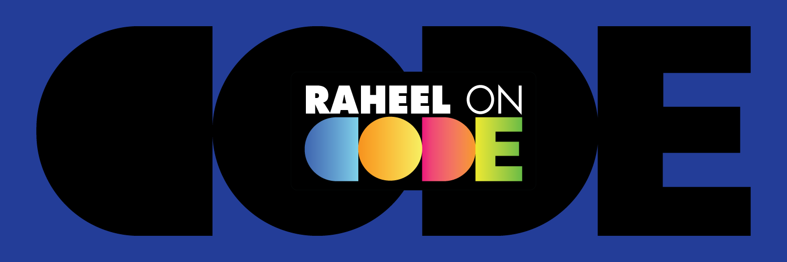

## About Me

Hi there! I'm **Raheel Arfeen Rahat**, a passionate **Full Stack Developer** with a growing love for backend technologies. I'm constantly learning and building exciting projects.

Currently, I'm diving deeper into:
- **Next.js**
- **Node.js**
- **Advanced Backend Development**

---

## Tech Stack

### Languages & Tools

### Backend & Tools

### Deployment & Version Control

### Design Tools

---

## GitHub Stats

| Top Languages | GitHub Stats | Streak |
|:---:|:---:|:---:|
|  |  |  |

---

## Contact Me

Email: [raheelarfeen@gmail.com](mailto:raheelarfeen@gmail.com)  
[LinkedIn](https://www.linkedin.com/in/raheelarfeen/)  
[Facebook](https://www.facebook.com/raheelarfeen/)

Let’s connect and collaborate on something amazing!
